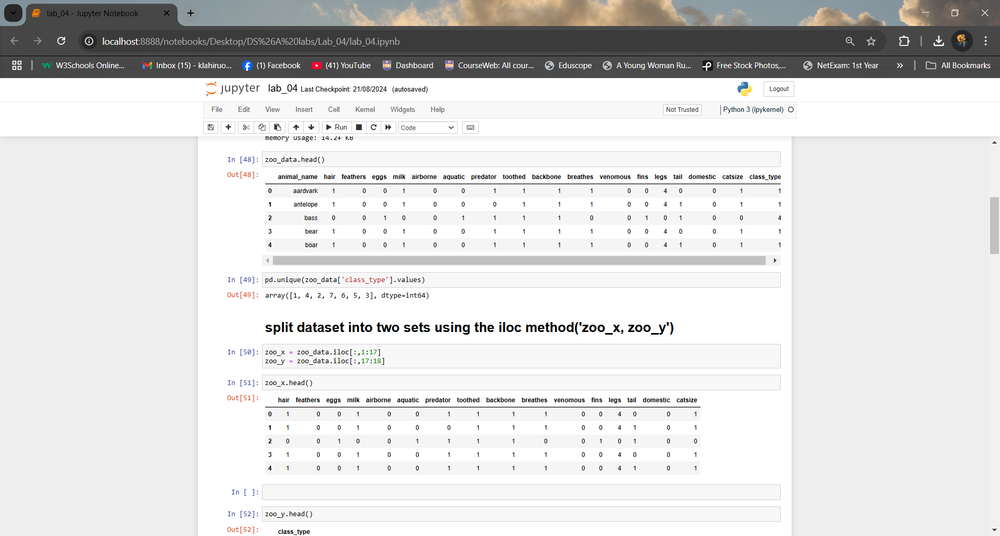
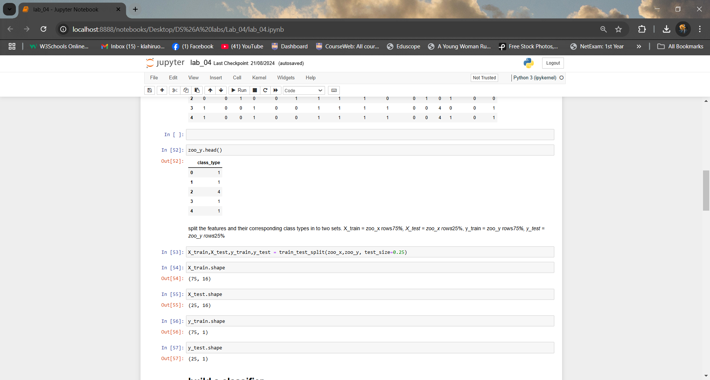
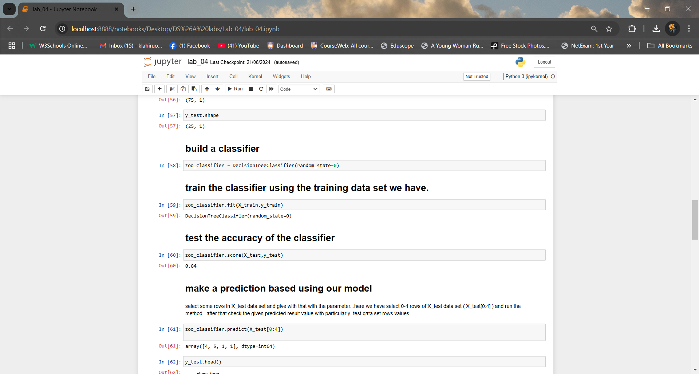
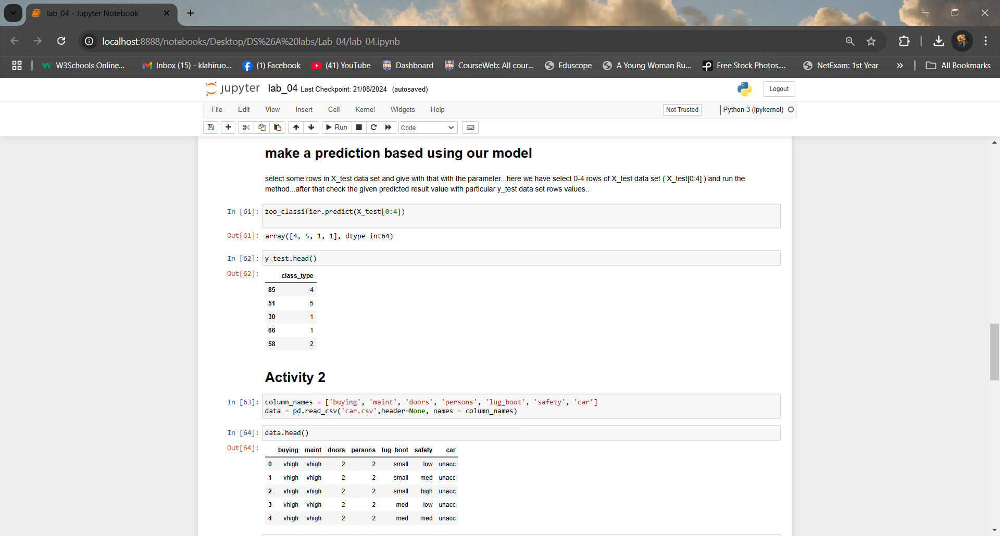
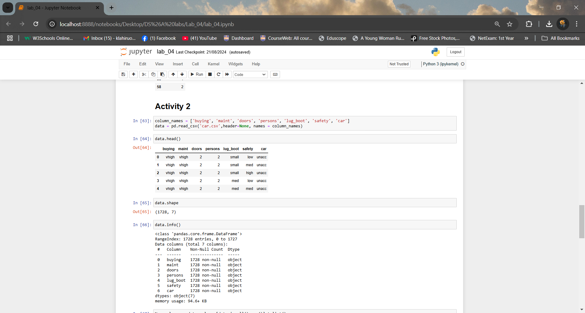
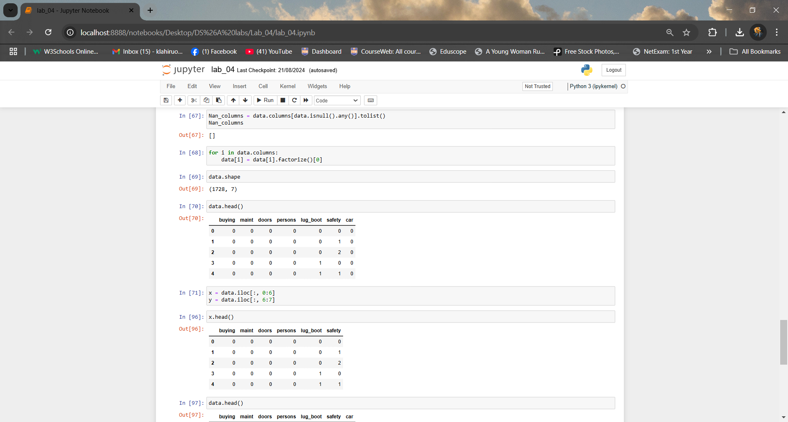
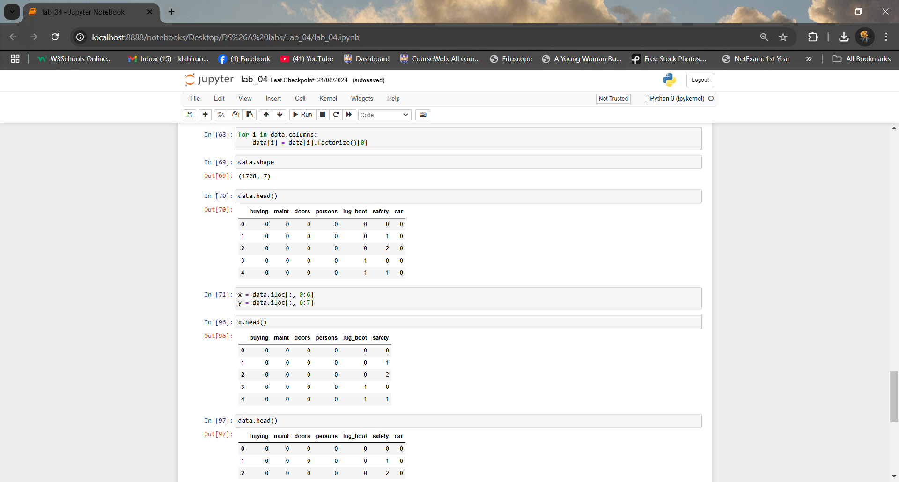
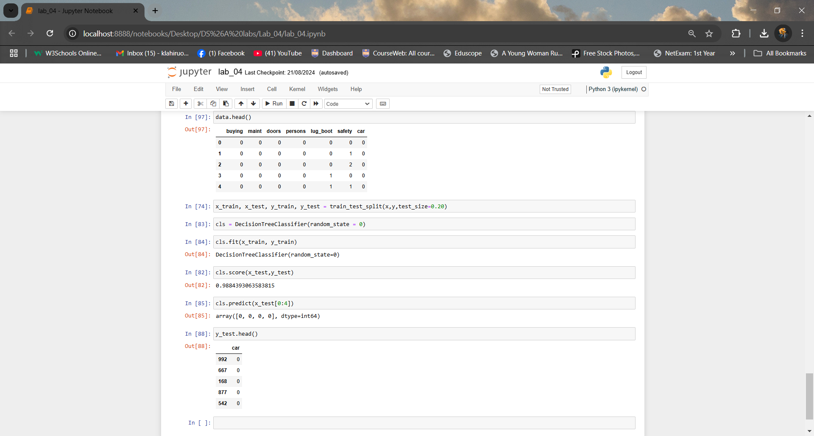

# 📊 Identify Animals Category Using Machine Learning  

This repository contains a **Machine Learning Classification Model** designed to predict Animal Category based on given features. The project follows a structured ML pipeline, including **data gathering, cleaning, model building, and inference** to ensure accurate and efficient predictions.  

---

## 📌 Project Overview  
The goal of this project is to implement a robust **ML classification model** capable of analyzing animal features and predicting potential Category.

### ✅ Key Steps in the Project  
1️⃣ **Gathering the Data** – Collecting relevant datasets containing animals features and corresponding categories.  
2️⃣ **Cleaning the Data** – Handling missing values, removing duplicates, and preprocessing categorical variables.  
3️⃣ **Model Building** – Training and evaluating different classification models to achieve high accuracy.  
4️⃣ **Inference** – Making real-time predictions based on user input symptoms.  

---

## 🚀 Features  
✔ **Data Preprocessing & Cleaning** for better model performance   
✔ **Machine Learning Model** trained using classification algorithms   
 

---

## 🏗️ Technologies Used  
- **Programming Language**: Python 🐍  
- **Libraries**: Pandas, Scikit-learn, Matplotlib,   
- **ML Algorithms**: Decision Trees.  

---

## 📊 Exploratory Data Analysis  
Here are some **visual insights** extracted from the dataset:











---

## ⚙️ How to Run the Project  
### 1️⃣ Clone the Repository  
```bash
git clone https://github.com/oshanLahiru0307/analyse-data-and-build-ml-model-using-classification.git
